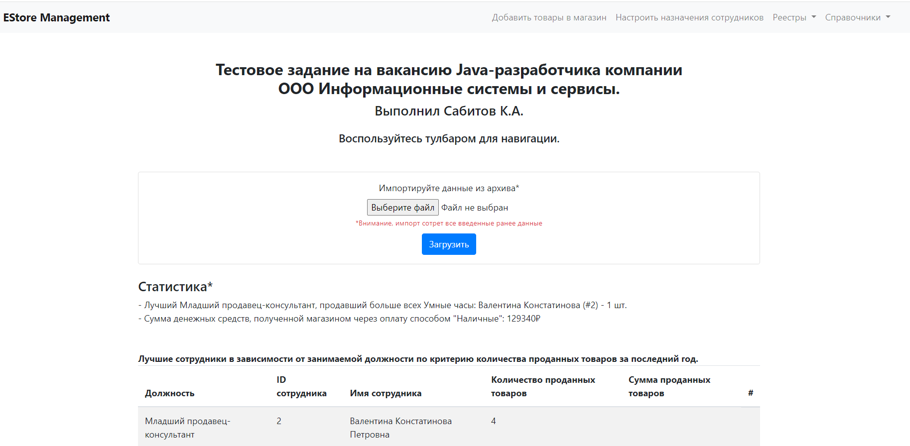
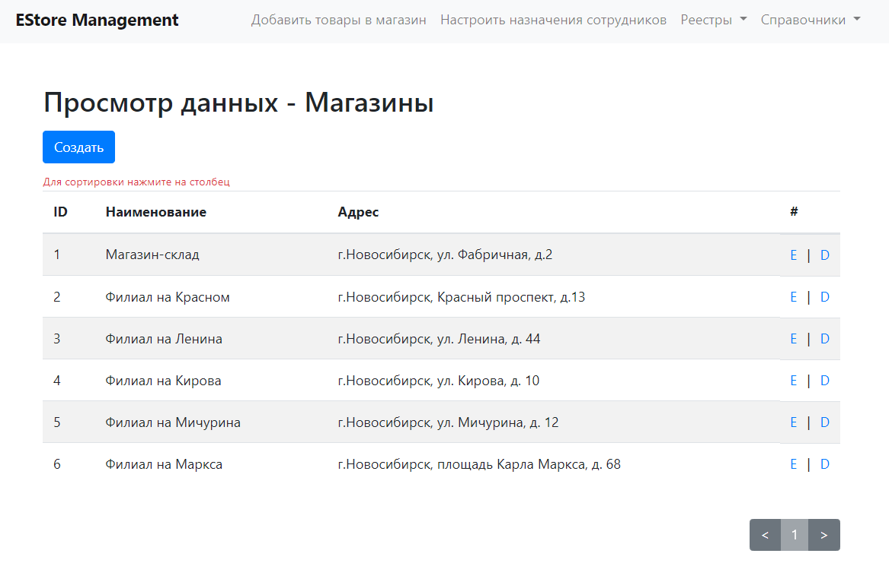
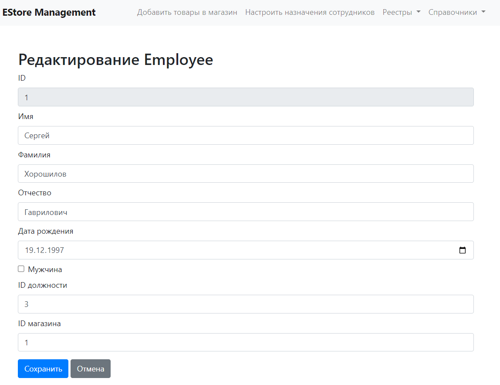
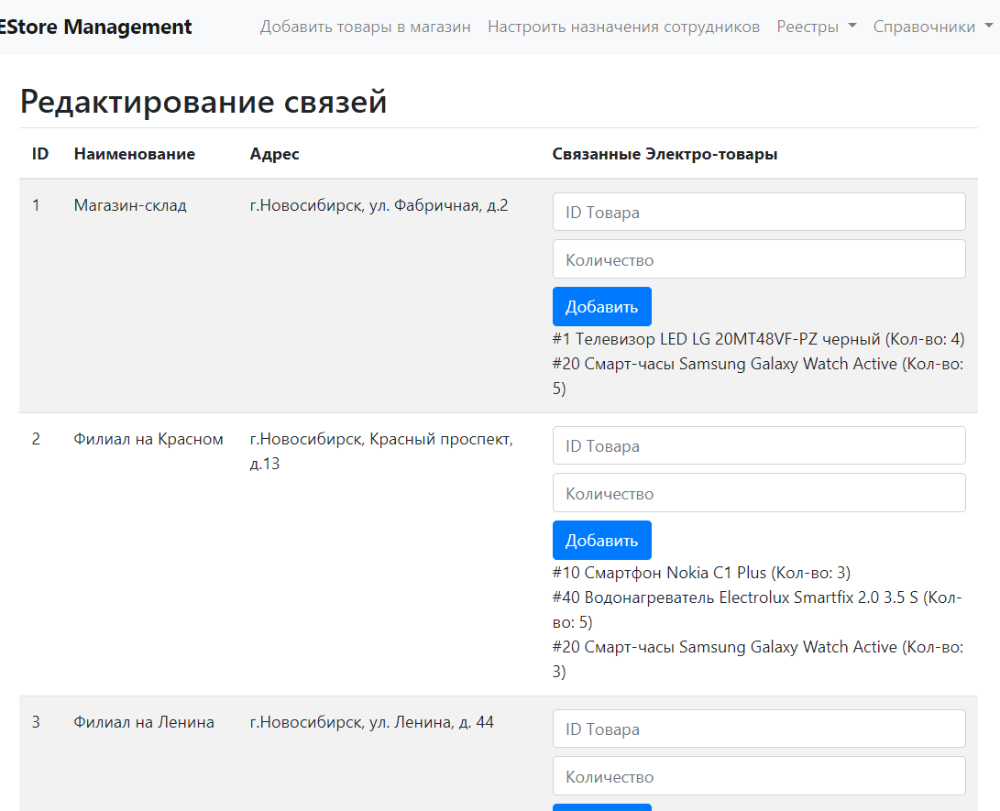

# EStore-microservice

Тестовое задание на вакансию Java-разработчика компании ООО Информационные системы и сервисы.



## О задании
Необходимо было разработать приложение для управления деятельностью сети магазинов электроники.
Приложение имеет Web-интерфейс, разделено на backend и frontend.

Приложение содержит доп. функционал:
1. Вывод информации о лучших сотрудниках в зависимости от
   занимаемой должности по следующим критериям:
   - Количество проданных товаров за последний год.
   - Сумма проданных товаров. Прописать обозначения за последний год.
2. Вывод информации по определенным критериям:
   - вывод лучшего младшего продавца-консультанта, продавшего больше всех умных часов;
   - вывод суммы денежных средств, полученной магазином через оплату наличными.

Основной функционал приложения содержит следующее:
1. Возможность хранения основных реестров и справочников с возможностью их редактирования и отображения
2. Возможность постраничного просмотра справочников и реестров
3. Возможность сортировки по любым полям справочников и реестров
4. Возможность импорта данных из zip-архива с csv-файлами из приложения. Архив должен соответствовать структуре - [см. файл](.gitassets/example.zip)
5. Реализована проверка необходимого товара в магазине на наличие. Если товара нет в наличие, пользователь уведомляется.

## Приступая к работе
Собран для крайней версии spring-boot **2.7.18**, добавлен springdoc-ui для автогенерации документации по разработанным rest-методам

Чтобы запустить локальную копию системы, выполните следующие простые действия.

### Компоненты
Убедитесь, что у вас установлены следующие компоненты:

- Oracle Java 11
- Apache Maven 3.9.8

### Установка
1. Клонируйте репозиторий
   ```shell
   git clone https://github.com/sabitovka/estore-microservice.git
   ```
2. Скомпилируйте проект с помощью Maven
   ```shell
   mvn clean compile
   ```
3. Запустите приложение
   ```shell
   mvn spring-boot:run
   ```

**Приложение доступно по адресу** http://localhost:8081
**Доступ к swagger-ui:** http://localhost:8081/estore-api.html

## Скриншоты
Просмотр справочников


Редактирование информации


Управление связями

